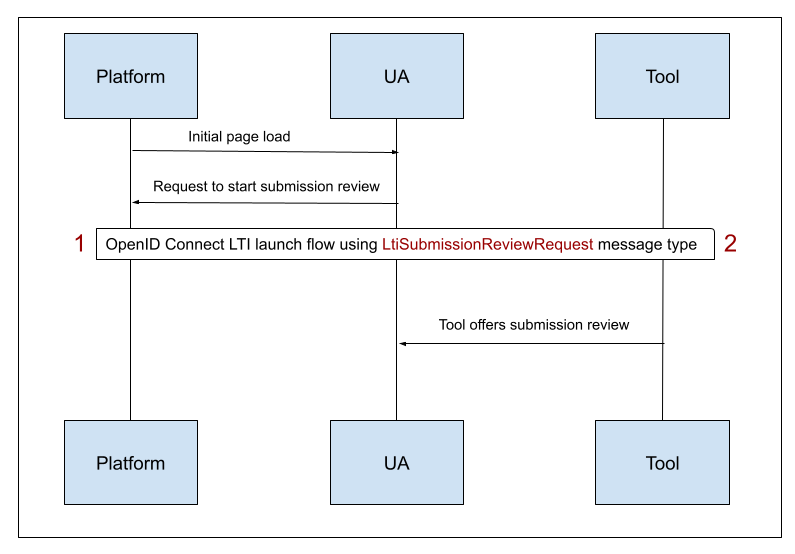

# Submission Review Message Workflow

> How to [perform secured submission review message interactions](https://www.imsglobal.org/spec/lti-sr/v1p0), between platforms and tools.

## Workflow

You can find below a submission review message workflow diagram, with steps numbers:



Each step will be detailed below, from both platform and tool perspectives.

## 1 - Platform side: LtiSubmissionReviewRequest message generation

You can find below required steps to generate a LtiSubmissionReviewRequest message, needed only if you're acting as a platform.

### Create the message

As a platform, you can create a [LtiSubmissionReviewRequest message](https://www.imsglobal.org/spec/lti-sr/v1p0) for a tool within the context of a registration.

Platforms can drive the tool behaviour on submission review interactions by providing [claims](https://www.imsglobal.org/spec/lti-sr/v1p0#ltisubmissionreviewrequest-claims) in this message.

You can use the [SubmissionReviewLaunchRequestBuilder](https://github.com/oat-sa/lib-lti1p3-submission-review/blob/main/src/Message/Launch/Builder/SubmissionReviewLaunchRequestBuilder.php) to create the message:

```php
<?php

use OAT\Library\Lti1p3Core\Message\Payload\Claim\AgsClaim;
use OAT\Library\Lti1p3Core\Message\Payload\Claim\ForUserClaim;
use OAT\Library\Lti1p3Core\Registration\RegistrationRepositoryInterface;
use OAT\Library\Lti1p3SubmissionReview\Message\Launch\Builder\SubmissionReviewLaunchRequestBuilder;

// Create mandatory submission review claims
$agsClaim = new AgsClaim(...);
$forUserClaim = new ForUserClaim(...);

// Create a builder instance
$builder = new SubmissionReviewLaunchRequestBuilder();

// Get related registration of the launch
/** @var RegistrationRepositoryInterface $registrationRepository */
$registration = $registrationRepository->find(...);

// Build LtiSubmissionReviewRequest message
$message = $builder->buildSubmissionReviewLaunchRequest(
    $agsClaim,                                                     // [required] AGS claim
    $forUserClaim,                                                 // [required] for_user claim
    $registration,                                                 // [required] related registration
    'loginHint',                                                   // [required] login hint that will be used afterwards by the platform to perform authentication
    'http://tool.com/submission-review',                           // [optional] tool url where to send the LtiSubmissionReviewRequest message (if none provided will use default tool launch url)
    null,                                                          // [optional] will use the registration default deployment id, but you can pass a specific one
    ['http://purl.imsglobal.org/vocab/lis/v2/membership#Learner'], // [optional] roles
    ['myCustomClaim' => 'myCustomValue']                           // [optional] supplementary claims if needed
);
```

Since [AGS line items can be coupled to LTI resource links](https://www.imsglobal.org/spec/lti-sr/v1p0#coupled-line-item-0), you can also use the `buildLtiResourceLinkSubmissionReviewLaunchRequest()` method to ease the message creation: 

```php
<?php

use OAT\Library\Lti1p3Core\Message\Payload\Claim\AgsClaim;
use OAT\Library\Lti1p3Core\Message\Payload\Claim\ForUserClaim;
use OAT\Library\Lti1p3Core\Registration\RegistrationRepositoryInterface;
use OAT\Library\Lti1p3Core\Resource\LtiResourceLink\LtiResourceLink;
use OAT\Library\Lti1p3SubmissionReview\Message\Launch\Builder\SubmissionReviewLaunchRequestBuilder;

// Create a resource link
$resourceLink = new LtiResourceLink('resourceLinkIdentifier');

// Create mandatory submission review claims
$agsClaim = new AgsClaim(...);
$forUserClaim = new ForUserClaim(...);

// Create a builder instance
$builder = new SubmissionReviewLaunchRequestBuilder();

// Get related registration of the launch
/** @var RegistrationRepositoryInterface $registrationRepository */
$registration = $registrationRepository->find(...);

// Build LtiSubmissionReviewRequest message
$message = $builder->buildLtiResourceLinkSubmissionReviewLaunchRequest(
    $resourceLink,                                                 // [required] resource link
    $agsClaim,                                                     // [required] AGS claim
    $forUserClaim,                                                 // [required] for_user claim
    $registration,                                                 // [required] related registration
    'loginHint',                                                   // [required] login hint that will be used afterwards by the platform to perform authentication
    'http://tool.com/submission-review',                           // [optional] tool url where to send the LtiSubmissionReviewRequest message (if none provided will use default tool launch url)
    null,                                                          // [optional] will use the registration default deployment id, but you can pass a specific one
    ['http://purl.imsglobal.org/vocab/lis/v2/membership#Learner'], // [optional] roles
    ['myCustomClaim' => 'myCustomValue']                           // [optional] supplementary claims if needed
);
```

### Launch the message

As a result of the build, you get a [LtiMessageInterface](https://github.com/oat-sa/lib-lti1p3-core/blob/master/src//Message/LtiMessageInterface.php) instance that has to be used in the following ways:

```php
<?php

use OAT\Library\Lti1p3Core\Message\LtiMessageInterface;

/** @var LtiMessageInterface $message */

// Main message properties you can use as you want to offer the launch to the platform users
echo $message->getUrl();                // url of the launch
echo $message->getParameters()->all();  // array of parameters of the launch

// Or use those helpers methods to ease the launch interactions
echo $message->toUrl();                // url with launch parameters as query parameters
echo $message->toHtmlLink('click me'); // HTML link, where href is the output url
echo $message->toHtmlRedirectForm();   // HTML hidden form, with possibility of auto redirection
```

### Implement OpenId Connect launch flow

Like any platform originating message, when the LtiSubmissionReviewRequest message is launched, an [OIDC flow](https://www.imsglobal.org/spec/security/v1p0/#platform-originating-messages) will start between the tool and the platform.

The underlying core library offers everything you need to securely implement this flow, as documented in the [platform originating messages documentation](https://github.com/oat-sa/lib-lti1p3-core/blob/master/doc/message/platform-originating-messages.md).

## 2 - Tool side: LtiSubmissionReviewRequest message handling

You can find below required steps to handle a LtiSubmissionReviewRequest message, needed only if you're acting as a tool.

### Validate the message 

As a tool, you'll receive an HTTP request containing the [LtiSubmissionReviewRequest message](https://www.imsglobal.org/spec/lti-sr/v1p0), generated by the platform, received after OIDC flow completion.

You can use the [ToolLaunchValidator](https://github.com/oat-sa/lib-lti1p3-core/blob/master/src/Message/Launch/Validator/Tool/ToolLaunchValidator.php) to validate it:

```php
<?php

use OAT\Library\Lti1p3Core\Message\Launch\Validator\Tool\ToolLaunchValidator;
use OAT\Library\Lti1p3Core\Registration\RegistrationRepositoryInterface;
use OAT\Library\Lti1p3Core\Security\Nonce\NonceRepositoryInterface;
use Psr\Http\Message\ServerRequestInterface;

/** @var RegistrationRepositoryInterface $registrationRepository */
$registrationRepository = ...

/** @var NonceRepositoryInterface $nonceRepository */
$nonceRepository = ...

/** @var ServerRequestInterface $request */
$request = ...

// Create the validator
$validator = new ToolLaunchValidator($registrationRepository, $nonceRepository);

// Perform validation
$result = $validator->validatePlatformOriginatingLaunch($request);

if (!$result->hasError()) {
    // You can access the related AGS line item
    $lineItemUrl = $result->getPayload()->getAgs()->getLineItemUrl();
    
    // You can access the user details for whom is done the submission review
    $user = $result->getPayload()->getForUser();
    
    // Then implement your logic to handle the LtiSubmissionReviewRequest message and offer submission review
}
```
**Note**: more details about platform originating messages on tool side validation can be found in the [platform originating messages documentation](https://github.com/oat-sa/lib-lti1p3-core/blob/master/doc/message/platform-originating-messages.md#4---tool-side-launch-validation).
